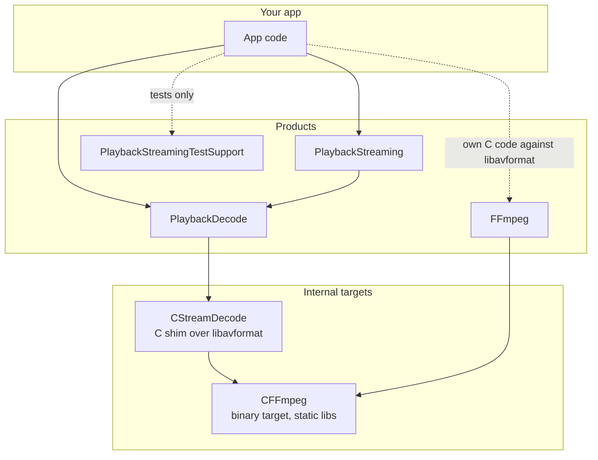
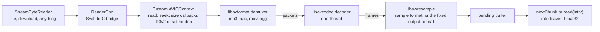
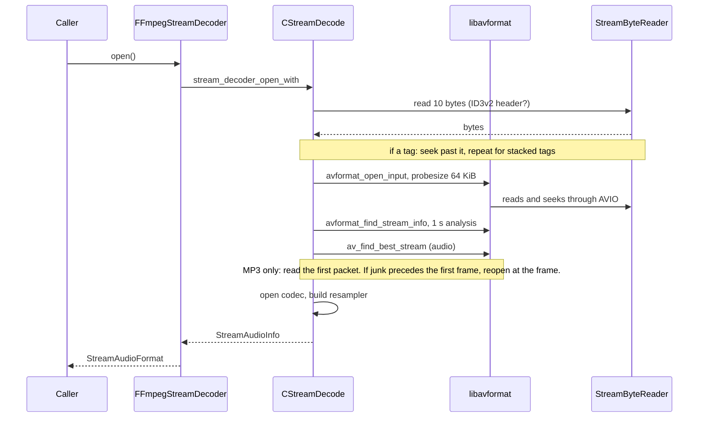
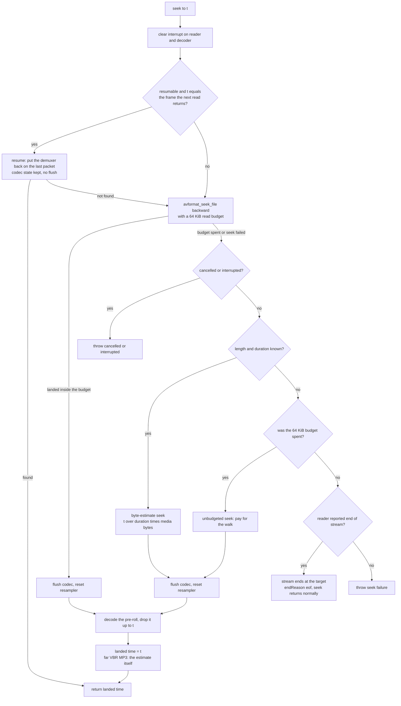
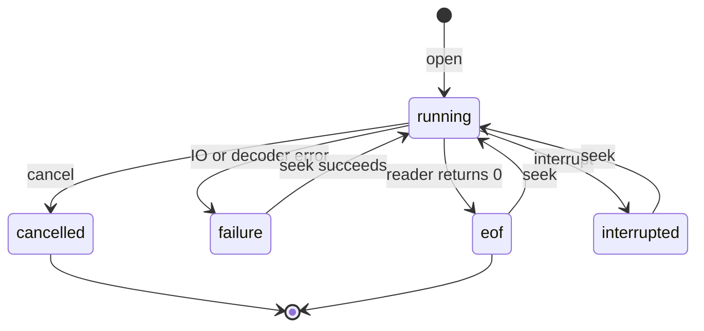
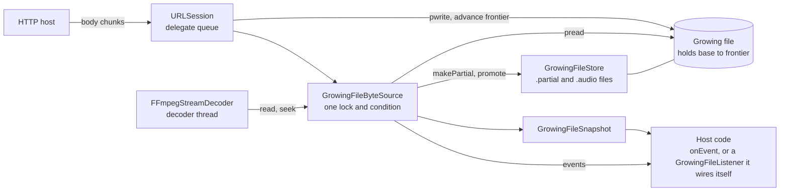
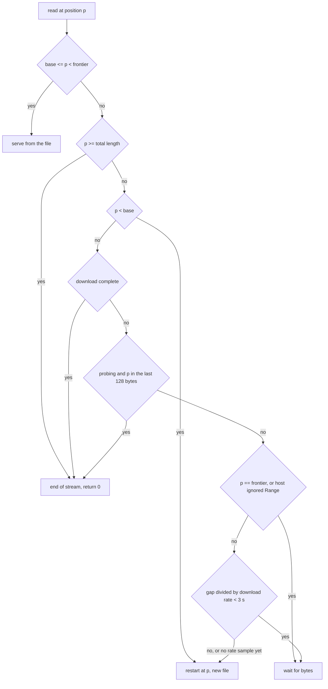
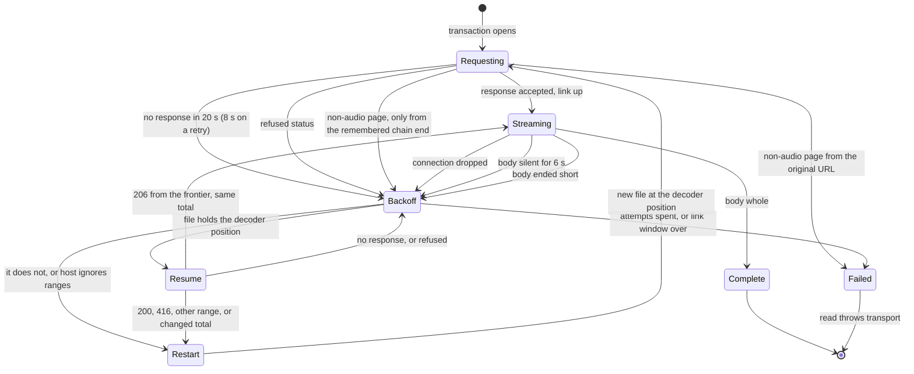

# Architecture

This page explains how the engine is put together and why it has the shape it has. It describes
three things: the package layout, the decode pipeline, and the growing-file byte source. It does not
tell you how to use them. For that, see [Integrating](integrating.md).

The decisions behind this design are in [decisions/](decisions/README.md).

## Package layout

The package has four products. A consumer links only the ones it imports.

- `PlaybackDecode` holds `FFmpegStreamDecoder`, the `StreamByteReader` protocol and `FileByteReader`.
  It links the C shim `CStreamDecode`, which links the static FFmpeg.
- `PlaybackStreaming` depends on `PlaybackDecode`. It adds the network byte source. A consumer that
  only decodes local files never links it.
- `FFmpeg` is the same static library exposed as its own product, for an app that has C code of its
  own against libavformat. An app links exactly one copy of FFmpeg, because two copies of the same
  static symbols are a duplicate-symbol link error.
- `CStreamDecode` is not a product. Its header is not public API.
- `PlaybackStreamingTestSupport` is a loopback HTTP server for tests. It depends on nothing.

The engine has no notion of podcasts, ads, queues, players or UI. Effects such as silence skipping
stay in the apps. See [ADR-0005](decisions/0005-shared-engine-repo.md).

## The decode pipeline

`FFmpegStreamDecoder` is a pull decoder. The caller asks for a chunk of PCM, and the decoder reads as
many bytes from its reader as it needs to produce it. Nothing is decoded ahead of the caller.

How the pieces behave:

- **The reader is blocking.** `read` may wait for bytes to arrive. The decoder calls it on its own
  thread. `cancel()` and `interrupt()` are the only calls made from another thread.
- **The seek callback is not optional.** With a read callback alone, FFmpeg treats the source as
  unseekable and the MP4 demuxer reads the whole `mdat` to reach a `moov` atom at the end of the file.
  The AVIO context has a size callback too (`AVSEEK_SIZE`), so a reader that knows its length lets
  FFmpeg jump to the end with one seek. A reader with no length answers "unknown", never a guess.
  With no length the decoder also sets `AVFMT_FLAG_IGNIDX` for its whole life, so the MP4 demuxer
  stops each root-atom read at the first `moov` and `mdat` it has, the way it reads an unseekable
  source: the header does not skip past the `mdat` looking for the end, and a fragmented MP4 reads
  one fragment at a time instead of running to the end of the file after the first.
- **A fragmented MP4 with AAC and no edit list loses its encoder priming (#25).** The edit list is
  what normally tells FFmpeg to skip the priming, and a fragmented file has none. The trim applies
  only when the `moov` (read from the leading 4 KiB the decoder already holds, so no extra I/O)
  contains an `mvex` and its audio `trak` has no `edts`/`elst`, and the first packet carries no
  skip. FFmpeg's public API cannot tell "no edit list" from "edit list with media_time 0", so a
  progressive file, or one whose edit list says no priming, is never trimmed; a `moov` that does
  not fit in 4 KiB is not trimmed either. The decoder then drops the file's iTunSMPB priming (only
  0 < priming < 16384, as FFmpeg accepts), else the codec's `initial_padding`, else 1024 samples
  (the least any AAC-LC first frame holds), and time zero is after them, so `duration`, seeks and
  the PCM start at the first real sample. HE-AAC is untouched. The 1024 is an assumption where the file says
  nothing: an encoder that primes with more (Apple's 2112) keeps the rest as a short lead-in.
  PCM for such files changes (a minor-bump behaviour change).
- **Leading ID3v2 tags are stepped over before FFmpeg sees them.** An MP3 with embedded cover art can
  carry megabytes of tag, and FFmpeg's MP3 demuxer reads all of it. The decoder reads the tag
  headers itself, seeks past them, and gives FFmpeg an offset-0 that is the first MPEG frame. The
  AVIO callbacks translate offsets, so the reader always sees real file offsets.
- **Output is at the source's own rate and channel count**, unless the caller fixed a format with
  `setOutputFormat(sampleRate:channelCount:)`. By default the resampler has the same rate and channel
  layout in and out, and only interleaves and converts whatever sample format the codec produced to
  Float32; it resamples only a stream whose rate changes mid-way, back to the rate it opened with.
  With a fixed format it resamples and remixes every frame to it, and the seek's discard of the
  frames before the target is counted at the output rate.
- **A mono source is spread to every output channel at full level, not swresample's -3 dB.** The
  matrix is set explicitly (up to 8 output channels; beyond that swresample's default stays). This
  also applies to the #14 format change on the default path: a stream opened as stereo that turns
  mono mid-way plays the mono half as loud on each side as it was, 3 dB louder than before this
  matrix. `testStereoToMonoSwitchMidStreamComesOutAtFullLevelOnBothChannels` covers it.
- **A chunk is `framesPerChunk` = 4096 frames.** About 93 ms at 44.1 kHz. Decoded audio that does not
  fit the chunk stays in the pending buffer for the next call.

### Open and probe

`avformat_find_stream_info` is skipped when the container header already describes the stream
(FLAC, ALAC in MP4, PCM in WAV or AIFF) and the duration is known without it; lossy codecs always
probe. A WAV from a source with a known length but unsized RIFF/data fields keeps the probe, which
recovers the duration from the file size. `forcesProbe` opts out (ADR-0011).

The probe budget is `StreamProbeBudget`. The default is 64 KiB and 1 s. FFmpeg's own defaults are a
5 MB probe and 5 s of analysis, which is too much when the bytes are cellular data. A caller whose
files need more analysis passes a larger budget to `FFmpegStreamDecoder.init`.

`open()` always throws on failure. It never returns a decoder that silently produces nothing.

### Seek

`seek(toSeconds:)` returns where the stream actually landed. The return value is the answer, not the
argument.

- **Landing is on the requested sample.** The demuxer is put a pre-roll before the target (16384
  samples, 32768 for Opus, 131072 for HE-AAC), and the decoder decodes it eagerly and drops
  everything before the target, so codec warm-up and partial frames never reach the caller. A
  constant-bitrate MP3 gets only the frames its bit reservoir can reach plus two (about 1 KiB at
  64 kbps), and every MP3 pre-roll is judged by the frames it actually feeds the codec: the frame two
  before the target's must find its `main_data_begin` bytes in the main data fed before it, or the
  seek is placed again four times further back (up to three times). That catches a VBR file with no
  tag, taken for CBR on its first frame, whose frames near the target carry less main data. An AAC
  codec is replaced by a fresh one at every seek, because a flushed one keeps state from before it
  (the noise generator, and HE-AAC's SBR and PS state). A fresh HE-AAC codec has no SBR or PS header
  until the next one arrives, hence its long pre-roll. A stream counts as HE-AAC once its parameters
  or any decoded frame say so, since an ADTS header says AAC-LC either way. Should no frame after a
  seek carry a timestamp, the decode is timed from where the demuxer was asked to go, which is
  exact from the start and within a frame elsewhere. An MP3 frame does not carry
  its time, so it is counted from a frame of known time: the first frame, a VBRI table entry, or
  for CBR the byte offset. A VBR MP3 target further from one than a seek's byte budget is placed by
  its Xing TOC or bitrate instead, and that estimate is the landed time (issue #3). A caller that
  sets its position to the requested time instead of the returned one drifts from the audio there.
- **The budget exists because of MP3 without a table of contents.** For those files FFmpeg's generic
  seek decodes forward from the start until timestamps reach the target. Measured on a fixture, one
  seek to 25 minutes read 12 MB. Once a seek has read 64 KiB, the next read is refused, the walk
  aborts, and the decoder places the seek by byte ratio instead. This is exact for constant bitrate
  and close for the rest. The estimate is reported as the landed time.
- **A source with no length and no container duration has nothing to estimate from.** After a blown
  budget the walk is the only seek there is, so it is allowed to run. A seek that failed without
  blowing the budget is not walked. If the reader said end of stream (a seek past the last frame),
  the stream ends at the target and `endReason` is `.eof`. Any other failure throws.
- **FFmpeg's fast-seek flag is set**, so an MP3 uses its Xing table of contents when it has one.
- **`mediaFramesRead` is media time.** After a seek it is set from the landed time and advances by the
  frames handed out.

### Interrupt, cancel and errors

Two calls can be made from another thread, and they mean different things.

| Call | Effect |
|---|---|
| `cancel()` | Ends the stream. The blocked read throws `cancelled`; `nextChunk()` returns nil with `endReason == .cancelled`. Final. |
| `interrupt()` | Ends the current blocked call only. The decoder stays open. The next `seek(toSeconds:)` clears it. |

`interrupt()` exists because a player's pull loop can be blocked in a read on a dead connection while a
seek waits behind it on the same queue. Cancelling would answer the seek by destroying the stream.

`nextChunk()` returning nil is not by itself the end of the stream. `endReason` says which of
`eof`, `failure`, `cancelled` or `interrupted` it was, and a caller must treat them differently.
Treating a network failure as the end of the stream would cut playback short without telling the
user, which is why the reason is kept.

An interrupted decode can resume without audible damage. If the next seek is to exactly the frame the
interrupted read would have returned, the decoder does not flush the codec. It puts the demuxer back
on the last packet it handed to the codec, reads that packet again and drops it, and carries on. MP3
and MP4 resume bit-exactly. Where the demuxer has no per-packet index (Ogg), the decoder falls back to
an ordinary seek.

Errors reach the caller as `StreamDecoderError`: `failed(status:)` for FFmpeg refusing the bytes,
`cancelled`, `interrupted` and `invalidState`. A reader error that is not a cancel or an interrupt
becomes an IO failure. A read that returns zero bytes means end of stream and is passed to FFmpeg as
EOF, never as zero, because FFmpeg treats a zero-length read as "try again" and spins forever.

## The growing-file byte source

`GrowingFileByteSource` is a `StreamByteReader` over an HTTP(S) URL. It plays a file while it
downloads. The download is one ranged request, written into a file on disk. The decoder reads that
file, and a read that reaches the end of the written bytes waits for more.

### Terms

- **Transaction.** One `GET` with `Range: bytes=<base>-` and the caller's auth headers. Each
  transaction writes one file. A restart is a new transaction, a new file, a new `base` and a new
  generation number.
- **Base.** The resource offset of the file's first byte.
- **Frontier.** One past the last byte on disk and readable. The file holds `[base, frontier)`.
- **Generation.** Counts transactions from 1. A resume after a drop keeps its generation. A restart
  or a host that ignores the range changes it.

### The read rule

Every read at a position is decided by `GrowingFileReadRule`. The decision is made at the first read at
a position, never at the seek. The MP3 footer probe seeks to the last 128 bytes, reads them and
seeks back. Deciding at the seek would cancel the head download for a read that never needed the
network.

The footer rule applies only while `isProbing` is set around the decoder's `open()`. Outside the
probe, the same read waits, or the last frames would be cut.

A parked read looks again every second (`recheckSeconds`). The measured download rate decays while no
bytes arrive, and nothing else wakes the read to notice.

A seek far ahead of the frontier is therefore a restart: the old transaction is cancelled and a new
one opens at the target, into a new file. A seek behind `base` is a restart too, since the file does not hold it.

### Recovery and retry

All network recovery lives in this class and nowhere else. `DownloadRetry` is the policy. It is a pure
value type with no clock or lock, so every branch is tested with literal numbers.

Failures come in two kinds:

- **Answered.** The host replied: a refused status, a body that ended short, a `200` where a `206`
  was needed. Each spends one of 3 attempts.
- **Unanswered.** Nothing came back: no network, a refused connection, no response in time, a body
  that went silent. These spend no attempt. They are retried while the next attempt can start inside
  the 30 s link window, measured from when the link went quiet. Only a response resets the window.

Backoff starts at 0.1 s, doubles on every failure in a row, and stops at 2 s.

- **Header wait.** A transaction's first request waits 20 s for its response, to allow a cold origin
  or a long redirect chain. A retry goes straight to the end of the redirect chain it remembers and
  waits 8 s. Neither waits past the end of the link window. The session's own timeout is a backstop.
- **Idle body.** Once a response has arrived, a body that goes 6 s without a byte is ended by the source
  and handled like a drop. With URLSession's default, a silent link held the read for 60 s.
- **Resume.** A retry whose file holds the decoder's position asks for `Range: bytes=<frontier>-`,
  with `If-Range` when the host gave a strong ETag. The bytes append to the same file under the same
  generation, so nothing already on disk is fetched again. The resume is accepted only if the host
  answers `206` starting at the frontier with the same total length.
- **Restart.** A retry whose file does not hold the position, or a refused resume, opens a new transaction at the
  decoder's position into a new file.
- **A refused or unanswered request to the remembered chain end** forgets that end. A signed redirect may
  have expired, so the next request walks the chain from the original URL once.
- **A non-audio response is a failure.** An HTML `Content-Type` is refused. When the type is not
  audio, video or Ogg, the first 12 bytes of the body are checked for a media signature instead, so
  a login page is never decoded. The failure is final unless the request went to the remembered end
  of the redirect chain: there the page may be a signed URL that expired, so it is retried from the
  original URL.
- **Past the retry budget the read throws** `StreamByteReaderError.transport`. Bytes already
  downloaded are still read first. The error stays until the next seek, which opens a fresh transaction
  with a fresh budget.
- **Progress resets the budget.** The frontier passing the decoder's position, or a restart nobody's
  failure caused, resets `DownloadRetry`.

A transaction that opens exactly at the end before the length is known (a seek to the end) gets `416`
with `Content-Range: bytes */N`, or a range clamped to the last byte. Either says the resource ends
where the request starts, so, as in media3's `DefaultHttpDataSource`, it is a zero-length open: the
length becomes `N` and the read returns 0, with no retry. Any other `416`, and an `N` that differs
from the length already known (the file shrank), is a refusal as above.

If the host ignores `Range` and answers `200`, the source marks the range as ignored. It re-declares the
file as starting at byte 0 under a new generation, and every later read ahead of the frontier waits
instead of restarting, because a restart would only be answered from byte 0 again.

### Files and the store

`GrowingFileStore` owns the directory, by default `Caches/growing`. The file name is the state.

| File | Meaning |
|---|---|
| `<uuid>.partial` | One per transaction. Deleted on restart, on `cancel()`, and swept at launch. Never reused by a later session. |
| `<sha256 of URL>.audio` | A transaction that completed from byte 0, renamed into place. Kept up to a 1 GiB budget, least recently played first out. |

`completedFile(for:)` returns the cached file for a URL, to be played with `FileByteReader`. Before a
transaction starts, the store evicts to make room if the volume would be left with less than 200 MB.

Partial files are never reused across sessions because a host can change the bytes behind a stable
URL, and old bytes would then play something the host no longer serves. See
[ADR-0003](decisions/0003-growing-file-playback.md).

### Snapshot and events

The decoder is the only thing that reads the byte source directly. Everyone else reads
`GrowingFileSnapshot`, a thread-safe copy of the state: `base`, `frontier`, `totalLength`,
`isComplete`, `fileURL`, `transactionGeneration`, `seekGeneration` and `downloadBytesPerSecond`
(averaged over 2 s).

A host can watch the source in two ways:

- `onEvent`, a closure passed to the initialiser, receives `GrowingFileEvent`: `transaction` when a
  response is accepted, `download` at most once a second while bytes arrive and once at
  completion, and `seekLanded` when a seek was answered from the file already there.
- `GrowingFileListener` is a protocol a host implements for the same events, each with a snapshot
  taken just after, plus two calls the host's own player makes (`playbackDidStart`,
  `playerWillSeek`) so a transaction opened by a seek can be paired with its target. The source
  does not take a listener: the host forwards the source's events and its own calls to the listener
  itself. A listener reads the file back through `fileURL`, so it can never see a byte the decoder
  did not have, and it never makes a second fetch.

`willSeek(generation:)` is how a player tags a seek. The next read that opens a transaction carries
that generation, and a read answered from the existing file reports the seek as landed instead.

## Threading

| Thread | Does |
|---|---|
| Decoder thread | `open`, `seek`, `nextChunk`, and the byte source's `read` and `seek`. Blocking. |
| URLSession delegate queue (serial) | Writes body bytes, advances the frontier, runs the retry policy. |
| Any thread | `cancel()`, `interrupt()`, `snapshot`. |

The decoder thread and the delegate queue meet under one lock and condition inside the byte source.
File I/O runs outside the lock. `GrowingFileByteSource.cancel()` must always be called, because a
running task retains its delegate, which is the source.

## Why the FFmpeg is committed

`Frameworks/FFmpeg.xcframework` is committed to git, not downloaded:

- SwiftPM does not run Git LFS, so a consumer resolving by git URL would get pointer files.
- There is no hosted CI to publish release assets. A `.binaryTarget(url:checksum:)` would need someone
  to upload a zip and update a checksum by hand on every rebuild.
- Anyone who can clone the repository can build it.

The cost is repository growth of a few MB each time FFmpeg is rebuilt. `.gitattributes` marks `*.a` as
binary, so git never diffs or normalises it.

Static linking an LGPL library into an app carries an obligation to let a user relink the app against a
modified FFmpeg. A commercial licence for this package does not change FFmpeg's own terms. If that
obligation matters to your distribution, take advice. The build is therefore plain LGPL-2.1 or later,
and the scripts never add `--enable-gpl`, `--enable-version3`, `--enable-nonfree` or an external
library. See [ADR-0001](decisions/0001-ffmpeg-for-demux-and-decode.md).

Local patches exist for FFmpeg bugs the pinned tag has and the decoder cannot work around. Patch 0001
is the case in point: with a source of unknown length, FFmpeg's MP3 demuxer stored the negative
"unknown" size in an unsigned variable and discarded the Xing frame count, so the gapless end trim and
the duration were lost.

## Why the tests are shaped this way

The conformance suite exists to prove that the decoder gives the same audio however the bytes arrive:
partial reads, one-shot I/O errors and a source of unknown length must each give a decode
bit-identical to the clean one. The golden diff is how a decoder change is reviewed, because a change
in the PCM shows up as a changed hash.

`DownloadRetry` and `GrowingFileReadRule` take no clock, lock or network, so their tests use literal
numbers. The byte source's tests drive time with a manual clock, so backoffs and the 30 s link window
run in milliseconds. A decoder bug the suite finds and nobody has fixed is pinned, rather than left as a
red test, so that a different finding, or a pinned finding that stops happening, still fails.
