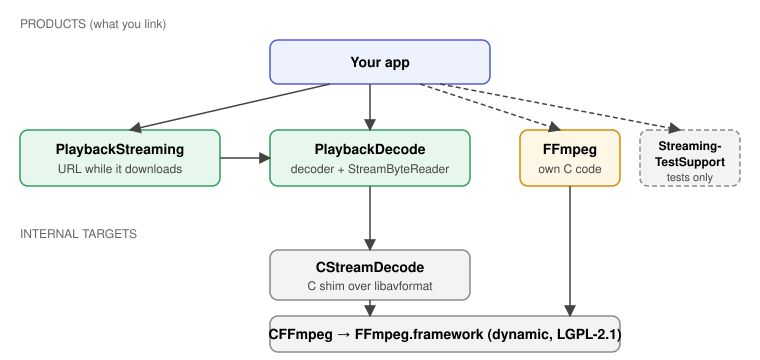
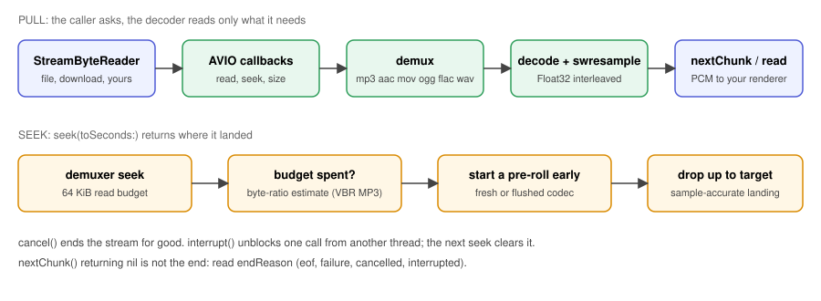
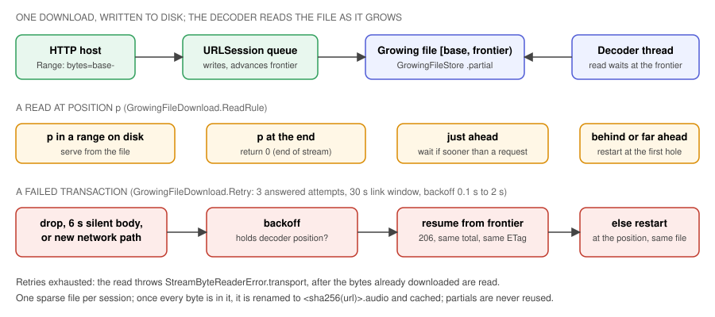

# Architecture

Three parts: a pull decoder over an abstract byte source, an opt-in network byte source that plays a
file while it downloads, and a committed static FFmpeg. The reasons behind each are in the
[decisions](decisions/README.md); the mechanics are in the source and its doc comments.

A consumer links only the products it imports. `PlaybackStreaming` depends on `PlaybackDecode`, so a
decode-only app never links the network code. The `FFmpeg` product exposes the same static library for
an app with its own C against libavformat; an app links one copy, since two copies of the same static
symbols fail to link. The engine knows nothing about podcasts, queues or UI, and effects stay in the
apps ([ADR-0005](decisions/0005-shared-engine-repo.md)).

## The decoder

`FFmpegStreamDecoder` (`Sources/PlaybackDecode`, with a C shim in `Sources/CStreamDecode`) is pull-based:
it reads from its `StreamByteReader` only as much as the caller's next chunk needs. Why it looks as it does:

- **Custom AVIO with a seek and a size callback.** With a read callback alone FFmpeg treats the source as
  unseekable, and an MP4 with a trailing `moov` reads the whole `mdat` first. A reader with no length
  answers "unknown", never a guess, and the decoder then ignores the MP4 index so a fragmented file reads
  one fragment at a time ([ADR-0001](decisions/0001-ffmpeg-for-demux-and-decode.md)).
- **Leading ID3v2 tags are stepped over before FFmpeg sees them.** Cover art can make a tag megabytes
  long and FFmpeg's MP3 demuxer reads all of it. The reader still sees real file offsets.
- **A small probe budget** (64 KiB, 1 s) because on a network each probed byte costs latency and data;
  an MP3 with more junk than that is resynchronised by a bounded scan, and header-described formats
  (FLAC, ALAC, PCM) skip the probe ([ADR-0011](decisions/0011-probe-budget-and-junk-resync.md)).
- **Seeks land on the sample.** The demuxer is placed a pre-roll early, the codec decodes it, and the
  decoder drops everything before the target ([ADR-0009](decisions/0009-seeks-are-sample-accurate.md)).
  Each seek has a 64 KiB read budget because FFmpeg's generic seek on an MP3 without a table of contents
  decodes forward from the start (one seek to 25 minutes read 12 MB); past the budget the decoder
  estimates by byte ratio, which is the one inexact landing. A FLAC without a seek table is found by its
  frame headers for the same reason.
- **`cancel()` and `interrupt()` differ** because a pull loop can be blocked on a dead connection while a
  seek waits behind it: cancelling would answer the seek by destroying the stream. `endReason` exists
  because a nil from `nextChunk()` is not always the end.
- **Format conversion is the decoder's** ([ADR-0010](decisions/0010-the-decoder-owns-output-format-conversion.md)).
- **A fragmented MP4 with AAC and no edit list loses its priming** in FFmpeg's public API, so the decoder
  trims it itself; see the comments in `Sources/CStreamDecode`.

## The growing-file byte source

`GrowingFileByteSource` downloads the resource once, as one ranged request, into a file on disk. The
decoder reads that file, and a read at the end of the written bytes waits
([ADR-0003](decisions/0003-growing-file-playback.md)). Vocabulary: a *transaction* is one `GET` and its
file; *base* is the resource offset of the file's first byte; *frontier* is one past its last readable
byte; a restart is a new transaction. Every rule below is `GrowingFileDownload`'s, a state machine
with no lock, task, file or clock: events in (a read, a seek, a response, bytes, a task's end, a timer,
a path change), effects out (serve, park, open a file, send a request, schedule a timer, fail). The
source is its adapter: one lock, the URLSession delegate, the file descriptors and the clock.

- **A read is decided when it happens, not at the seek** (`GrowingFileDownload.ReadRule`, a pure function): the MP3 footer probe seeks to the tail and back, and deciding at the seek would cancel
  the head download for a read that never needed the network. A small gap ahead waits; a far one, or a
  position behind `base`, restarts the download there.
- **Recovery lives only in this class** ([ADR-0004](decisions/0004-one-recovery-layer-in-the-byte-source.md)).
  `GrowingFileDownload.Retry` (a pure value type) spends 3 attempts on failures the host answered and a 30 s link
  window on ones nothing answered. A retry resumes from the frontier when the host gives the same range
  and total, otherwise restarts at the decoder's position. A body silent for 6 s, or a network path
  change, ends the transaction like a drop.
- **A non-audio answer is a failure**, so a login page is never decoded.
- **Partial files are never reused across sessions**, because a host can change the bytes behind a
  stable URL. A transaction that completes from byte 0 becomes a cached `.audio` file.
- **Threading.** The decoder thread owns `read`/`seek`; the URLSession delegate queue writes bytes and
  runs the retry policy; they meet under one lock and condition. `cancel()`, `interrupt()` and
  `snapshot` are safe from any thread.

## FFmpeg

`Frameworks/FFmpeg.xcframework` is the committed LGPL-2.1 static build: one superset for both apps
([ADR-0006](decisions/0006-one-superset-ffmpeg.md)), with local patches for bugs in the pinned tag.
Static linking carries an obligation to let a user relink against a modified FFmpeg, and the build never
enables GPL, version3, nonfree or an external library; take advice if that matters to your distribution.
Rebuilding is in [contributing](contributing.md#rebuilding-ffmpeg).
